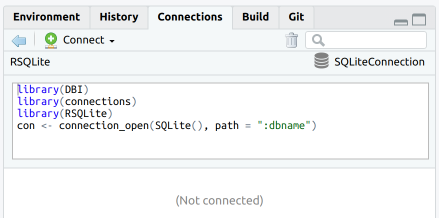
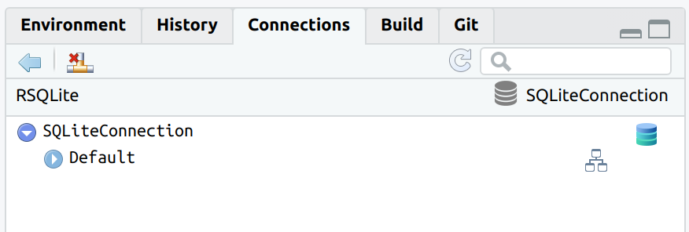
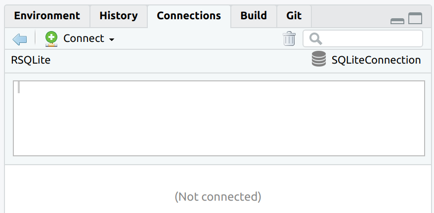
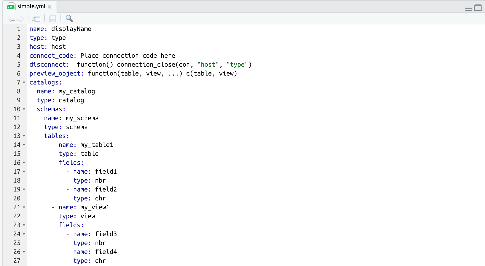

<!-- README.md is generated from README.Rmd. Please edit that file -->

```{r, include = FALSE}
knitr::opts_chunk$set(
  collapse = TRUE,
  comment = "#>",
  fig.path = "man/figures/README-",
  out.width = "100%",
  eval = FALSE
)

toc <- function() {
  re <- readLines("README.Rmd")
  has_title <- as.logical(lapply(re, function(x) substr(x, 1, 2) == "##"))
  only_titles <- re[has_title]
  titles <- trimws(gsub("#", "", only_titles))
  links <- trimws(gsub("`", "", titles))
  links <- tolower(links)
  links <- trimws(gsub(" ", "-", links))
  toc_list <- lapply(
    seq_along(titles),
    function(x) {
      if(substr(only_titles[x], 1, 3) == "###") {
        paste0("<ul><li><a href=#", links[x], ">", titles[x], "</a></li></ul>")  
      } else {
        paste0("<li><a href=#", links[x], ">", titles[x], "</a></li>")  
      }
    }
  )
  toc_full <- paste(toc_list, collapse = "") 
  paste0("<ul>", toc_full, "</ul>")
}
```

# connections

<!-- badges: start -->
[](https://www.tidyverse.org/lifecycle/#experimental)
[](https://travis-ci.com/edgararuiz/connections)
[](https://codecov.io/gh/edgararuiz/connections?branch=master)
<!-- badges: end -->

`r toc()`

## Intro 

The main goal of `connections` is to integrate `DBI`-compliant packages with the RStudio IDE's [Connection
Pane](https://db.rstudio.com/rstudio/connections/).  Packages such as [RPostgres](https://github.com/r-dbi/RPostgres), [RSQLite](https://github.com/r-dbi/RSQLite), [RMariaDB](https://github.com/r-dbi/RMariaDB) and [bigrquery](https://github.com/r-dbi/bigrquery) connect R to those databases, but do not provide a direct integration with the Connections Pane. `connections` reads the configuration of the connection and creates the integration with RStudio.

A second goal of `connections` is to provide a simpler API to the way RStudio Connections pane integrates with R.  This is meant for use by advanced R developers who wish to create custom connection configurations, or for `DBI`-compliant package developers who wish to directly integrate the Connections pane with their package. 

## Installation

Install the development version from [GitHub](https://github.com/) with:

``` r
# install.packages("remotes")
remotes::install_github("edgararuiz/connections")
```

## Basic Use

Simply use `connection_open()`, instead of `dbConnect()`, to open the connection.  The same arguments used for `dbConnect()` can be passed to `connection_open()`.

```{r}
library(connections)
library(RSQLite)
library(DBI)

con <- connection_open(SQLite(), path = ":dbname:")
```

 <br/>

`connection_open()` integrates with `DBI`, so creating a new table in the database will automatically refresh the Connections Pane.

```{r}
dbWriteTable(con, "db_mtcars", mtcars)
```

 <br/>

The "Preview table" is also integrated to pull the top 1,000 records.

 <br/>

To close the connection, use `connection_close()` or via the "Disconnect" button in the Connections pane.  This will close the connections pane, and also the database connection.

```{r}
connection_close(con)
```

 <br/>

After closing, the code that can be used to re-connect is displayed in the Connections pane.  

## DBI-compliant packages 

The main use for `connections` is to integrate the Connections pane with `DBI`-compliant connection packages.  These packages include: 

- [RPostgres](https://github.com/r-dbi/RPostgres)
- [RSQLite](https://github.com/r-dbi/RSQLite)
- [RMariaDB](https://github.com/r-dbi/RMariaDB)
- [bigrquery](https://github.com/r-dbi/bigrquery)

An example of using `connections` with [RSQLite](https://github.com/r-dbi/RSQLite) is shown in the examples above.  Here is an example of using `connections` with [RPostgres](https://github.com/r-dbi/RPostgres):

```{r}
library(RPostgres)
library(DBI)

con <- connection_open(
  Postgres(), 
  host = "sol-eng-postgre.cihykudhzbgw.us-west-2.rds.amazonaws.com",
  dbname = "finance",
  user = "xxxxx",
  password = "xxxxx",
  port = 5432
)

```

 <br/>

The code to reconnect is automatically created.  `connection_open()` makes sure to also add a `library()` call for the respective `DBI`-compliant package.

 <br/>

## Non-integrated mode

Even if `dbConnect()` is used to connect to the database, it is still possible to use the Connections pane.  

```{r}
con <- dbConnect(SQLite(), path = ":dbname:")
```

After connecting, use `connection_view()` to populate the Connections pane.  Pass the connection variable to it.

```{r}
connection_view(con)
```

 <br/>

Updating the database after the connection will not automatically refresh the Connections pane.  

```{r}
dbWriteTable(con, "db_mtcars", mtcars)
```

To refresh the Connections pane, use `connection_update()`

```{r}
connection_update(con)
```

 <br/>

In this case, the code to reconnect will not be available after closing.  

```{r}
connection_close(con)
```

 <br/>

It is also possible to customize the `host`, `name`, and `connection_code` in `connection_view()`.  The idea is to make it easier to distinguish each connection in the list, as well as to provide a way to set the re-connection code.

```{r}
con <- dbConnect(SQLite(), path = ":dbname:")

connection_view(
  con, 
  host = "my_host", 
  name = "my_name",
  connection_code = "library(connections)\ndbConnect(...)"
  )
```

 <br/>

Connection code is sourced from `connection_code`

 <br/>

## Advanced Users

To create a custom connection structure use a `list` object. The main advantage of using this pattern is that the tree structure of **database**/**schema**/**table**/**fields** can be passed as a nested `list`.   

```{r}
my_conn <-  list(
    name = "name",
    type = "type",
    host = "host",
    connect_code = "",
    connection_object = "",
    icon = "/usr/home/edgar/R/x86_64-pc-linux-gnu-library/3.6/connections/images/package-icon.png",
    disconnect = function() connection_close(my_conn, "host", "type"),
    preview_object = function() {},
    catalogs = list(
      name = "Database",
      type = "catalog",
      schemas = list(
        name = "Schema",
        type = "schema",
        tables = list(
          list(
            name = "table1",
            type = "table",
            fields = list(
              name = "field1",
              type = "chr")
            ),
          list(
            code = list(as.list(data.frame(name = "view1", type = "view", stringsAsFactors = FALSE)))  
          )
        ))
    ))

conn_list <- connection_contract(my_conn)
connection_view(conn_list)
```

 <br/>

The `list` can also be sourced from a non-blob file, such as a YAML file. `connections` provides a few examples, here is the `simple.yml` file being used to source a Connections pane.

```{r}
spec_path <- system.file("specs", "simple.yml", package = "connections")
simple_spec <- yaml::read_yaml(spec_path)
```

 <br/>

```{r}
con <- connection_contract(simple_spec)
connection_view(con)
```

 <br/>
