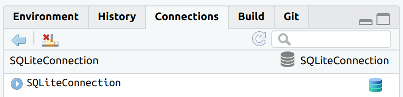
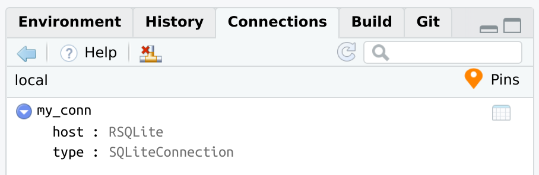
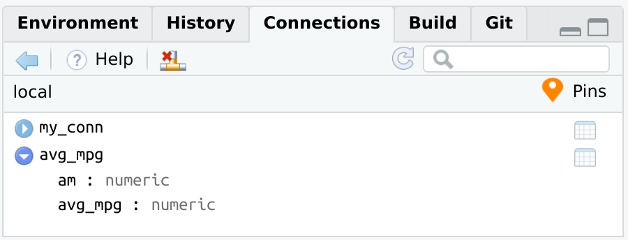
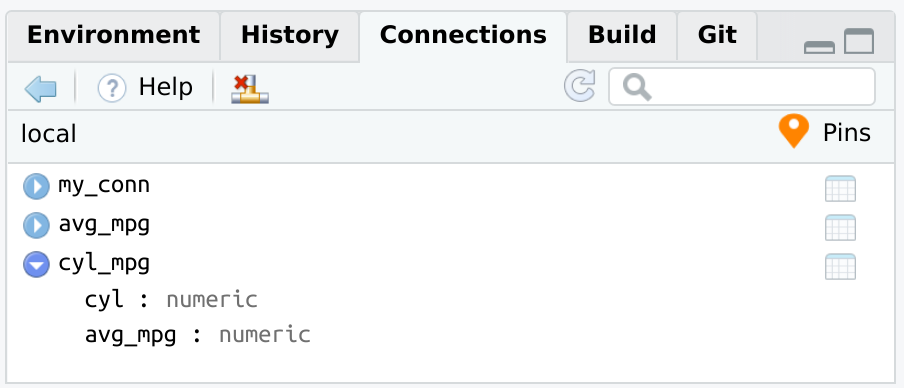
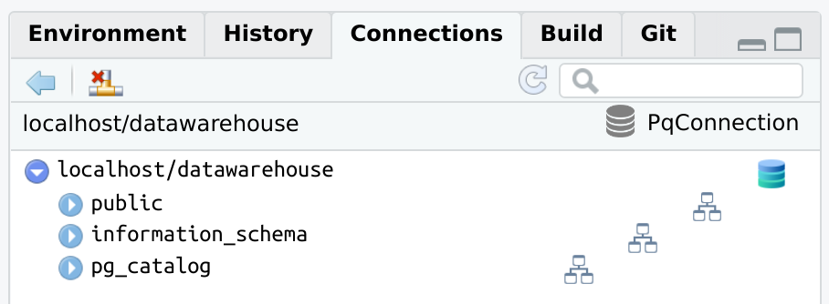
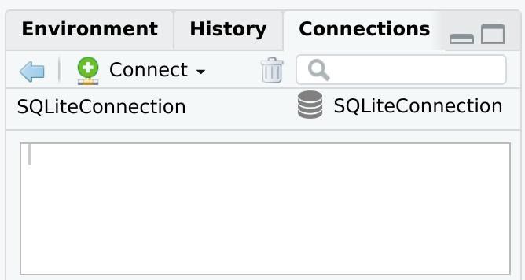

<!-- README.md is generated from README.Rmd. Please edit that file -->

# connections

<!-- badges: start -->

[](https://lifecycle.r-lib.org/articles/stages.html#experimental)
[](https://github.com/rstudio/connections/actions/workflows/R-CMD-check.yaml)
[](https://app.codecov.io/gh/rstudio/connections?branch=main)
<!-- badges: end -->

- [Installation](#installation)
- [Functions](#functions)
- [Uploading and referencing tables with
  `dplyr`](#uploading-and-referencing-tables-with-dplyr)
- [`pins`](#pins)
  - [Pin a database connection](#pin-a-database-connection)
  - [Pin a `dplyr` database query](#pin-a-dplyr-database-query)
  - [Full `pins` example](#full-pins-example)
- [Back-end examples](#back-end-examples)
  - [BigQuery, via `bigrquery`](#bigquery-via-bigrquery)
  - [PostgreSQL, via `RPostgres`](#postgresql-via-rpostgres)
- [`DBI` connections](#dbi-connections)

The main goal of `connections` is to integrate `DBI`-compliant packages
with the RStudio IDE’s [Connection
Pane](https://solutions.posit.co/connections/db/tooling/connections/).
Packages such as [RPostgres](https://github.com/r-dbi/RPostgres),
[RSQLite](https://github.com/r-dbi/RSQLite),
[RMariaDB](https://github.com/r-dbi/RMariaDB) and
[bigrquery](https://github.com/r-dbi/bigrquery) connect R to those
databases, but do not provide a direct integration with the Connections
Pane. `connections` reads the configuration of the connection and
creates the integration with RStudio.

A second goal is to provide integration with the
[pins](https://pins.rstudio.com/) package. The `connections` package
allows you to pin database connections and
[dplyr](https://dplyr.tidyverse.org/) table objects.

## Installation

Install the development version from [GitHub](https://github.com/) with:

``` r
# install.packages("remotes")
remotes::install_github("rstudio/connections")
```

## Functions

The two main functions added by `connections` are:

- `connection_open()` - Opens the database connection. Use instead of
  `dbConnect()`, but use the exact same arguments. It also automatically
  starts the Connections pane.
- `connection_close()` - Closes the database connection.

``` r
library(connections)
library(RSQLite)

con <- connection_open(SQLite(), "local.sqlite")
```

<br/>

The connection can now be closed by using the appropriate button in the
Connections pane, or by using `connection_close()`

``` r
connection_close(con)
```

<br/>

The connection code is parsed when connecting to the database, and it is
visible once the connection is closed.

## Uploading and referencing tables with `dplyr`

`connections` integrates with `dplyr` by supporting the following two
functions:

- `tbl()` - To create a pointer to a table or view within the database.
- `copy_to()` - To copy data from the R session to the database.

The version of `copy_to()` inside `connections` automatically updates
the Connections pane, so the new table automatically shows up.

``` r
con <- connection_open(SQLite(), "local.sqlite")

copy_to(con, mtcars, temporary = FALSE, overwrite = TRUE)
#> # Source:   table<mtcars> [?? x 11]
#> # Database: sqlite 3.41.2 [/Users/edgar/r_projects/connections/local.sqlite]
#>      mpg   cyl  disp    hp  drat    wt  qsec    vs    am  gear  carb
#>    <dbl> <dbl> <dbl> <dbl> <dbl> <dbl> <dbl> <dbl> <dbl> <dbl> <dbl>
#>  1  21       6  160    110  3.9   2.62  16.5     0     1     4     4
#>  2  21       6  160    110  3.9   2.88  17.0     0     1     4     4
#>  3  22.8     4  108     93  3.85  2.32  18.6     1     1     4     1
#>  4  21.4     6  258    110  3.08  3.22  19.4     1     0     3     1
#>  5  18.7     8  360    175  3.15  3.44  17.0     0     0     3     2
#>  6  18.1     6  225    105  2.76  3.46  20.2     1     0     3     1
#>  7  14.3     8  360    245  3.21  3.57  15.8     0     0     3     4
#>  8  24.4     4  147.    62  3.69  3.19  20       1     0     4     2
#>  9  22.8     4  141.    95  3.92  3.15  22.9     1     0     4     2
#> 10  19.2     6  168.   123  3.92  3.44  18.3     1     0     4     4
#> # ℹ more rows
```

To use an existing table inside the database use `tbl()`.

``` r
db_mtcars <- tbl(con, "mtcars")
```

<br/>

The `tbl()` function opens the rest of the already available `dplyr`
database integration.

``` r
db_mtcars %>%
  group_by(am) %>%
  summarise(avg_mpg = mean(mpg, na.rm = TRUE))
#> # Source:   SQL [2 x 2]
#> # Database: sqlite 3.41.2 [/Users/edgar/r_projects/connections/local.sqlite]
#>      am avg_mpg
#>   <dbl>   <dbl>
#> 1     0    17.1
#> 2     1    24.4
```

## `pins`

The `connections` package integrates with `pins`. It adds the ability to
“pin” database connections and queries. It follows the same approach as
the
[vetiver](https://rstudio.github.io/vetiver-r/reference/vetiver_pin_write.html)
package. `connections` now has two new functions:

- `connection_pin_write()`
- `connection_pin_read()`

### Pin a database connection

The `connection_pin_write()` function does **not** save the R object. It
records the code necessary to recreate the connection.

``` r
library(pins)
board <- board_folder("~/pins")

connection_pin_write(board, con, name = "my_conn")
#> Creating new version '20231215T141203Z-8d9ce'
#> Writing to pin 'my_conn'
```

<br/>

If you wish to see the code that `connections` will use when recreating
the conneciton from the pin, you can use `connection_code()`:

``` r
connection_code(con)
#> library(connections)
#> library(RSQLite)
#> con <- connection_open(SQLite(), "local.sqlite")
```

`connection_pin_read()` will replay the exact same code used to
initially connect to the database. Assign the output to a variable, such
as `con1`. The variable will work just like any connection variable.

``` r
con1 <- connection_pin_read(board, "my_conn")
```

The `con1` variable is now a regular database connection variable.

``` r
db_mtcars <- tbl(con1, "mtcars") %>%
  group_by(am) %>%
  summarise(avg_mpg = mean(mpg, na.rm = TRUE))

db_mtcars
#> # Source:   SQL [2 x 2]
#> # Database: sqlite 3.41.2 [/Users/edgar/r_projects/connections/local.sqlite]
#>      am avg_mpg
#>   <dbl>   <dbl>
#> 1     0    17.1
#> 2     1    24.4
```

### Pin a `dplyr` database query

When `dplyr` works with database data, the resulting query is not
executed until the data is explicitly collected into R, or when printing
the top results to the R Console. The `pin` records two things:

- The `dplyr` R object that contains all of the transformations. **It
  does not save the actual results**.

- The necessary information to recreate the database connection. This is
  to make sure that the data is being retrieved from the original
  database connection.

``` r
connection_pin_write(board, db_mtcars, name = "avg_mpg")
#> Creating new version '20231215T141203Z-41590'
#> Writing to pin 'avg_mpg'
```

<br/>

`connection_pin_read()` will connect to the database, and return the
`dplyr` object. Without assigning it to a variable, the pin will
immediately print the results of the database. Those results are being
processed at the time `connection_pin_read()` runs.

``` r
connection_pin_read(board, "avg_mpg")
#> # Source:   SQL [2 x 2]
#> # Database: sqlite 3.41.2 [/Users/edgar/r_projects/connections/local.sqlite]
#>      am avg_mpg
#>   <dbl>   <dbl>
#> 1     0    17.1
#> 2     1    24.4
```

### Full `pins` example

The way `pins` integrates with databases, via the `connections` package,
allows to open the connection from a pin, and pipe all of the subsequent
code into a new pin. Afterwards, that pin can be used to collect or to
continue using the `dplyr` object.

``` r
board <- board_folder("~/pins")

con <- connection_pin_read(board, "my_conn")

tbl_summary <- con %>%
  tbl("mtcars") %>%
  group_by(cyl) %>%
  summarise(avg_mpg = mean(mpg, na.rm = TRUE))


connection_pin_write(board, tbl_summary, name = "cyl_mpg")
#> Creating new version '20231215T141203Z-59396'
#> Writing to pin 'cyl_mpg'

connection_close(con)

connection_pin_read(board, "cyl_mpg")
#> # Source:   SQL [3 x 2]
#> # Database: sqlite 3.41.2 [/Users/edgar/r_projects/connections/local.sqlite]
#>     cyl avg_mpg
#>   <dbl>   <dbl>
#> 1     4    26.7
#> 2     6    19.7
#> 3     8    15.1
```

<br/>

## Back-end examples

There are a couple of examples of how the Connections pane will look
when opening the connection via `connections`.

### BigQuery, via `bigrquery`

``` r
library(connections)
library(bigrquery)

con <- connection_open(
  bigquery(),
  project = "bigquery-public-data",
  dataset = "austin_311",
  billing = "my_project_billing",
  use_legacy_sql = FALSE
)
```

<br/>

``` r
connection_close(con)
```

<br/>

### PostgreSQL, via `RPostgres`

``` r
library(connections)
library(RPostgres)
con <- connection_open(
  Postgres(),
  host = "localhost",
  dbname = "datawarehouse",
  user = "[user id]",
  password = "[password]",
  bigint = "integer",
  port = "5432"
)
```

<br/>

## `DBI` connections

It is possible to integrate `DBI` connections not opened via
`connection_open()`. To do that, use `connection_view()` and pass it the
variable containing the existing database connection.

``` r
library(DBI)

con <- dbConnect(RSQLite::SQLite(), ":memory:")

connection_view(con)
```

<br/>

Changes to the database will not automatically load in the Connections
pane. The `connection_update()` function will refresh the pane with the
latest.

``` r
dbWriteTable(con, "mtcars", mtcars)

connection_update(con)
```

<br/>

``` r
connection_close(con)
```

<br/>
