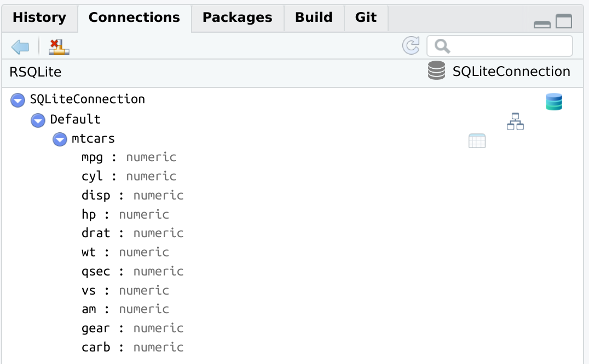

<!-- README.md is generated from README.Rmd. Please edit that file -->

# connections

<!-- badges: start -->

[](https://www.tidyverse.org/lifecycle/#experimental)
<!-- badges: end -->

Provides a generic implementation of the [RStudio Connection
Contract](https://rstudio.github.io/rstudio-extensions/connections-contract.html)
to make it easier for database connections, and other type of
connections, opened via R packages to take advantage of the Connections
Pane inside the RStudio IDE.

## Installation

Install the development version from [GitHub](https://github.com/) with:

``` r
# install.packages("remotes")
remotes::install_github("edgararuiz/connections")
```

## Example

``` r
library(DBI)
library(connections)
con1 <- dbConnect(RSQLite::SQLite(), path = ":dbname:")
dbWriteTable(con1, "mtcars", mtcars)
view_connection(con1)
```



<br/>

``` r
dbWriteTable(con1, "ToothGrowth", ToothGrowth)
update_connection(con1)
```
